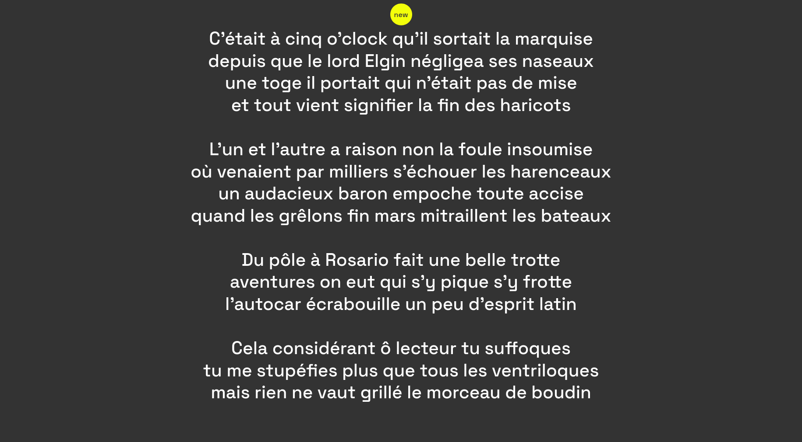

# cent-mille-milliards-de-poemes

Generate a poem among the [Hundred Thousand Billion Poems](https://en.wikipedia.org/wiki/Hundred_Thousand_Billion_Poems), written by Raymond Queneau

Used [AssemblyScript](https://www.assemblyscript.org) to play with [WebAssembly](https://developer.mozilla.org/en-US/docs/WebAssembly)

